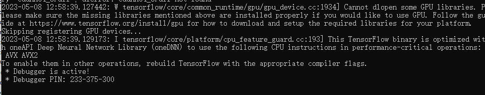
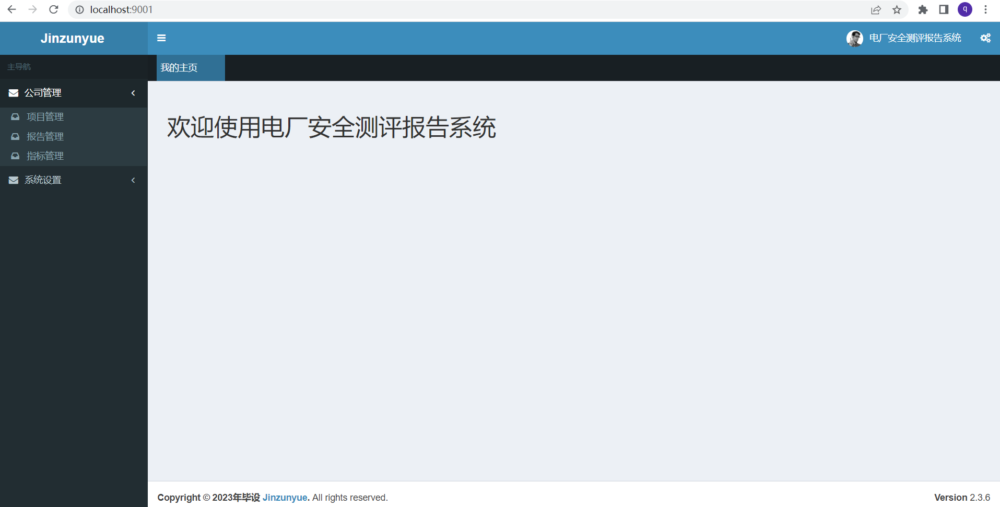

## 项目简介

本系统是电厂安全测评报告系统，本科毕设，菜鸟的第一个相对完整的系统

基础脚手架地址：https://github.com/yangxiufeng666/common-admin
感谢作者

## 内置功能
1. 系统基础管理
   - 1.1 用户管理 
   - 1.2 角色管理 
   - 1.3 菜单管理
   - 1.4 API说明
   - 1.5 数据库日志
   - 1.6 项目管理
   - 1.7 报告管理
   - 1.8 指标管理

## 技术选型
* TensorFlow 2.4.1 
* Python 3.8
* Flask 
* 核心框架：Spring boot 1.5.6
* 安全框架：Apache Shiro 1.4
* 持久层框架：mybatis、mybatis plus 2.1.2
* 数据库连接池：Alibaba Druid 1.1.2
* 数据库：MYSQL
* API文档管理：swagger2 2.7.0
* Excel导出工具：easy-poi 3.0.1
* 模版引擎：freemarker
* 前端UI框架：JQuery2.2.3 + bootstrap3 + AdminLte2.3.6 + Ztree

## 账密
super 123456

admin 123456

yangxiufeng 123456

## 运行

1）启动python。python项目在python分支下，下载到本地后运行如下命令启动。
```python
python NumOfPicAPI.py
```


2）启动SpringBoot项目。




